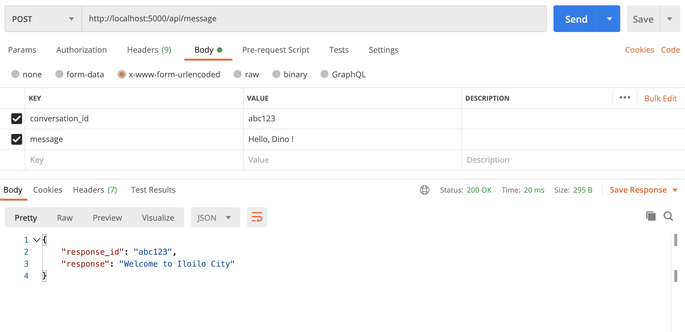

# Node API

This project was bootstrapped with NodeJS, Express, Typescript, Eslint, Prettier

## Available Scripts

In the project directory, you can run:

development:

### `npm run start`

production build:

### `npm run build`

Endpoints:
Open [http://localhost:5000/api/message](http://localhost:5000/api/message)

## Screenshot

